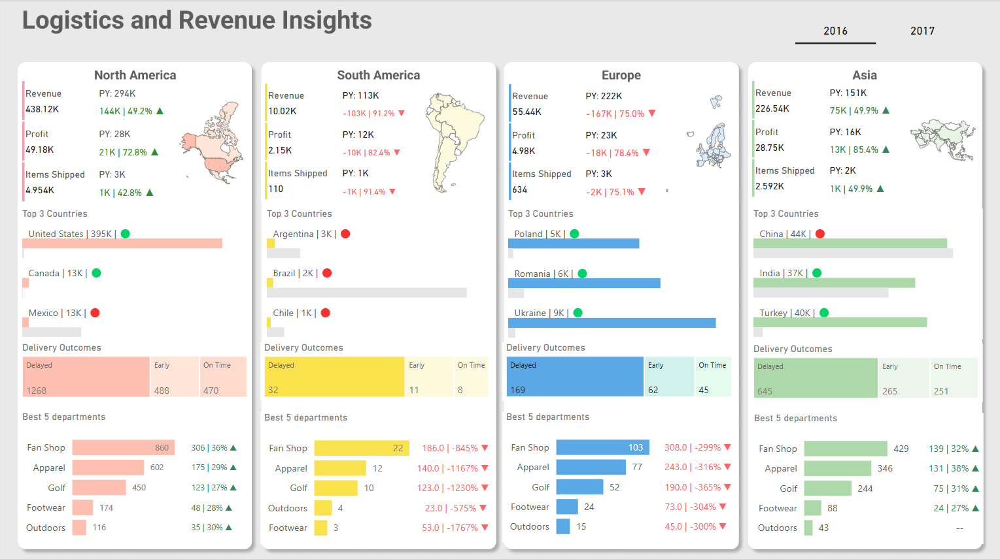

# 📊 Logistics and Revenue Insights

A **Power BI dashboard** focused on **logistics and revenue insights** across different regions. This project was inspired by a **LinkedIn post from Injae Park** and built using historical data from Kaggle.

## 🌍 Features
- **Revenue and profit analysis** across four regions
- **Top-performing countries and departments**
- **Delivery performance tracking** (On-time, Early, Delayed)
- **Interactive visualizations with maps**

## 🎨 Design
- **Background:** [Figma Design](./figma/background.png)
- **Color Palette:**
  -  `#808080`
  -  `#E6E6E6`
  -  `#2E8B57`
  -  `#FF6366`
  -  `#FFE6D9`
  -  `#FDBFAF`
  -  `#E4FCED`
  -  `#5AA9E6`
  -  `#FEFAE0`
  -  `#FAE24C`
  -  `#EEF7EE`
  -  `#ACD8AA`

## 🛠 Tools & Resources
- **Kaggle datasets** ([data](https://www.kaggle.com/datasets/pushpitkamboj/logistics-data-containing-real-world-data/data)) for historical data (2016-2017)
- **Tabular Editor** to replicate measures across regions
- **GeoJSON Maps** ([geojson-maps.kyd.au](https://geojson-maps.kyd.au/)) for custom map visuals

## 📌 Limitations
- **Russia was excluded** due to space constraints
- **Africa was not included** in this version

